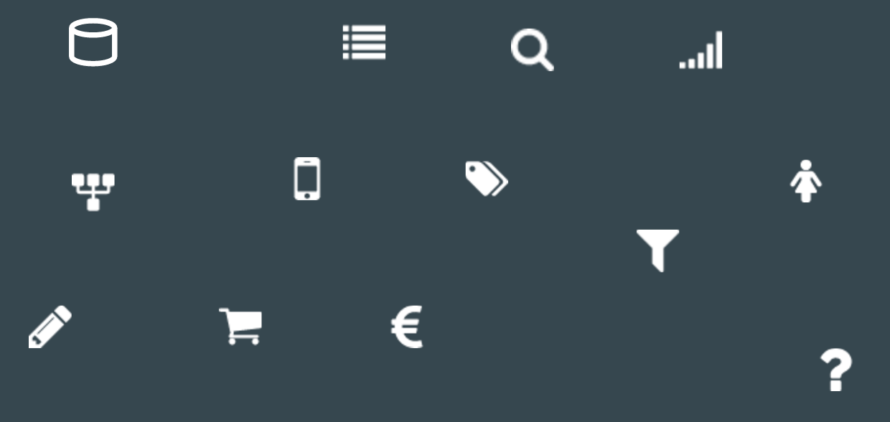
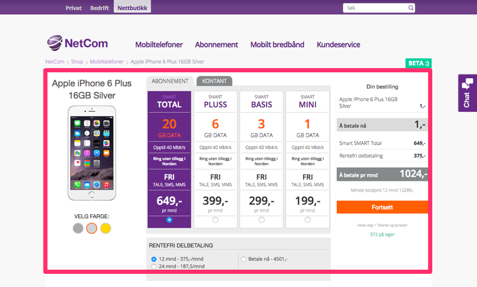
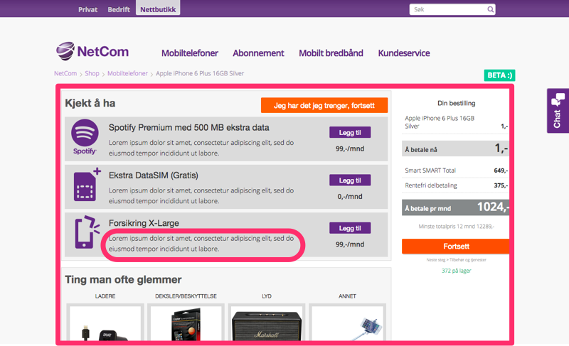
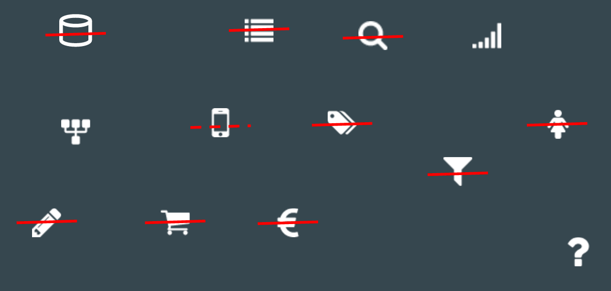

Replacing legacy systems typically starts with an excitement, proceeds through
months or years of work, and results in a failure. The incremental strangling
of the old shop.netcom.no is a very different story and the approach is
rightfully called "extreme" by the rest of the organization. Read on to learn how
we have been replacing the legacy webshop one tiny bit at a time. I also hope
to share my continual amazement at how much work can be postponed to be able to
deliver a "feature" early.

*A part of the [series Nettbutikk Team's Experiences and Experiments](/tags/nettbutikk)*

([See Extreme minimalism: Replacing shop.netcom one tiny bit at a time at Vimeo](https://vimeo.com/145011983) (10 min).)

## My best ‘project’ ever

Nettbutikk.netcom.no is the best project - though I rather say product development -
I have ever been to. When asked why, this was my answer:

> Full stack & full control: frontend, backend, ops. Great people & ideally
> small team. Very pragmatic, minimalistic and evolutionary approach to the dev
> process. Working closely with the business and seeing the app actually matters
> to them and influences real people every day.

I.e.

1. We do everything - front-end, back-end, operations, we deploy whenever we want to.
2. The team is really small and totally awesome
4. We sit together with the business and work together all the time
5. The application is really important for the business - and every line of code
I release to production can improve (or destroy) the experiences for thousands
of people.

There are many things I am excited about in this project but today I want to focus on one thing.

Normally when people speak about their favourite project, they brag about what
they did. I want to brag about what we have not done.

## Background: Extreme Minimalism Mind-set

One of the great things about this team is its minimalist mind-set:

1. We get by with the minimal process possible, and continually evolve it,
 add and (preferably) remove from it as we learn and our needs change. No Jira,
 no demos (the business sees every new change anyway), no retrospectives (we
 practice continuous improvement), ...
2. We are library and tool skeptics (thanks, Alex!) - we only add a it if we
really need to, if skipping it or writing it ourselves isn’t reasonable
3. We always try to trim a feature down to the bare minimum and release the
smallest possible chunk of functionality that adds any value to us,
the business, or our customers <--- this is what I will focus on today

## The goal of nettbutikk.netcom.no

NetCom had - or actually has - this huge, inflexible webshop rented from a 3rd
party and customized. But the business wanted something different, something
that would actually fit their needs, evolve continuously, enable them to experiment.
Something where the time from an idea to production wouldn't be months but days
or hours.

So they have decided to get a few skilled developers, having them sitting together
with the business (instead of being outsourced) and writing their own webshop.

To me this sounds very scary. As far as I know, most of the "let’s ditch this
non-trivial software and write it from scratch" projects fail badly.

And when you think about it, you need a lot to implement a webshop:

* You obviously need a database
* Get data from primary sources and transform the for the views
* Enhance / override the primary data
* Product listing (for all product types)
* Product details page (for all product types)
* Checkout, payment
* Filtering, search, categories
* Analytics
* user login
* (and certainly many things I have forgotten)

This sounds like at least 1 year project with a big-bang release at the end.
You cannot release half of a webshop, right? You can’t release a perfect webshop
without checkout, where people can’t actually buy stuff.

## Our first release:

**Product details page of a single product variant**

Well, our first release was a single page - product details of one variant of
one product. We have released it in just a few weeks (though more than the two
I hoped for).

## Here it is:

So you would navigate the old shop and when you clicked on iPhone 6 plus 16GB,
you would come to our page. You could select a color, subscription, ...

... services and accessories. And when you clicked on the "Fortsett" button, you
would go to checkout in the old shop again. And even the "shopping cart" - the
configuration of your order - would mostly just reuse the shopping cart in the
old shop via an ugly iframe hack.

## So there is a lot we did not need to do:

Later, we extended it to all variants, all iPhones, eventually all phones,
phone listing, all product types, ... .

Nowadays, 10 months since start, we have everything, only the checkout still
lives in the old system. (And we are looking forward to getting rid of it as well!)

## The Four Techniques

How do we do it? How do we trim the next chunk of functionality to the total minimum? We
apply these techniques:

**You Don’t Need It Just Yet. Postpone it!**

1. Do it manually
2. Hardcode it
3. Reuse
4. Slice & Dice

The key principle is "You Don’t Need It Just Yet". There is a lot you truly need,
but most likely it can wait a day - or a few weeks
(and you can hardcode it or do it manually in the meantime).
The magic words "in the first phase [or day]" (and, possibly, "experiment") can
help you to get this across to the business people that are always eager to get
more cool stuff out. (And, of course, by doing less now we get eventually more done!)

It is also very important to remember - and to communicate to the business - that
you only need not to be worse than the existing functionality - improvements,
bug fixes, and additions may wait. (Even though we more less managed to follow
this maxim, everything we did is better and performs better than in the old shop :-) .)

1. Do it manually - you can get shockingly far with doing things manually.
During many months, our heroic biz people duplicated data between the old and
new webshop instead of automatically syncing them. And we still need to add
new phones manually to the webshop.
2. Hardcode it - with just a few minutes to deploy, the developers sitting with
the business, and possibly only a small subset of
products, a lot may be hard-coded instead of having a CMS to add/override data.
These days, when we need to show "Checkout down for maintenance," we still just
change it in code, release, and then re-deploy the previous version.
3. Reuse what is there, even though it certainly gets ugly quickly. We have
reused the shopping cart via an iframe and still use the checkout process in the
old shop.
4. Slice & Dice: Release the smallest subset of the feature for just one use
case / target group first. We have started with a page for a single product
variant - which decreased the complexity considerably. And when developing a new
cart functionality, we applied it first just to accessories - and only the part
users cannot see in the UI (though they use it).

I am constantly surprised how far we can get with these.
It works best when having colleagues that challenge you on doing even less, on
hardcoding and doing manually a little more than you would want to. (We are
developers after all, we love automation!)

## Always ask:

**Do I need it *now*?**

(Hint: Most of the time the answer is no.)

## Want to know more?

* [Work with me!](https://netcom.no/disrupt-us)
* Contanct me at Twitter [@HolyJak](https://twitter.com/HolyJak)
* Learn more about our journey at the [Telia Tech Blog](http://techblog.telia.no/)

Thank you!
